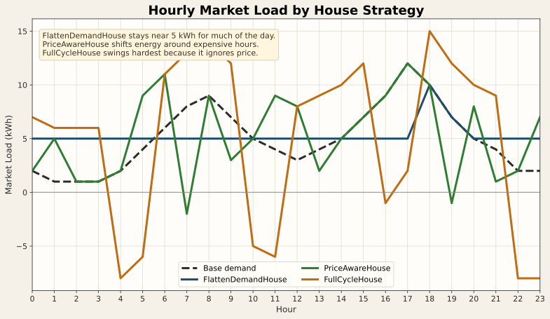
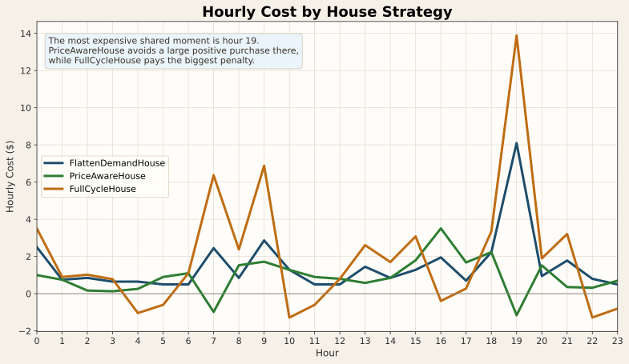
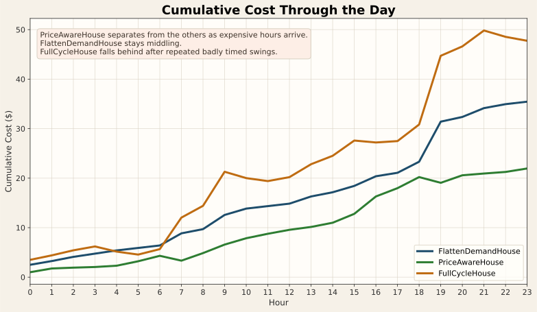

# Market Game Strategy Tutorial

This guide explains how the market price moves, how the example houses respond,
and what behavior you should expect when you run them together.

If you want the quick "how do I edit a house?" guide, start with
[market_game.md](/c:/CodeProjects/HELICS-Examples/python/market_game/market_game.md).
This document goes deeper and is meant to help players build intuition.

The basic local run instructions live in
[market_game.md](/c:/CodeProjects/HELICS-Examples/python/market_game/market_game.md),
and this tutorial assumes that same launcher flow.

## Reproducing The Example Run

From [python/market_game](/c:/CodeProjects/HELICS-Examples/python/market_game):

```powershell
python run_neighborhood.py houses
helics run --path=houses.json
```

That generated runner:

- starts an explicit HELICS broker on `localhost:23404`
- launches the example `*_house.py` files from `houses/`
- launches the market maker against the same broker
- adds `--no-plot` so the run exits cleanly after the 24-hour simulation

## Big Picture

Each house receives:

- the current hour's market price
- its own 24-hour demand profile
- its current battery charge

Each house returns one number: how much energy it wants to buy from the market
this hour.

That one number does two jobs at once:

- it covers the house's normal load
- it can also charge or discharge the battery

If a house buys more than its base demand, the extra energy charges the battery.
If it buys less than its base demand, the battery makes up the difference.

## The Pricing Pattern

The market maker computes:

- `M = total neighborhood demand / number of houses`

Then it sets the next hour's price from `M`:

- `M < 3.0`: `$0.10/kWh`
- `3.0 <= M < 6.0`: `0.10 + 0.03 * (M - 3.0)`
- `6.0 <= M < 9.0`: `0.19 + 0.10 * (M - 6.0)`
- `9.0 <= M < 13.0`: `0.49 + 0.25 * (M - 9.0)`
- `M >= 13.0`: `1.49 + 1.00 * (M - 13.0)`

That means the price has a few important regions:

- Low-demand region: below `M = 3`, price is flat and cheap.
- Medium-demand region: from `M = 3` to `M = 9`, price rises steadily.
- High-demand region: above `M = 9`, price gets expensive fast.
- Extreme-demand region: above `M = 13`, every extra kWh is painful.

The price also lags by one hour:

- what houses do this hour affects the price published for the next hour

That lag matters a lot. A house is always reacting to the price that was caused
by the previous neighborhood behavior.

## Visual Intuition

These charts are useful while reading the examples:


## Battery Constraints

Every house has the same battery:

- Capacity: `20` kWh
- Starting charge: `0` kWh
- Max charge rate: `5` kWh per hour
- Max discharge rate: `10` kWh per hour

The base [House](/c:/CodeProjects/HELICS-Examples/python/market_game/house_template.py)
template checks the return value from `compute_demand()`. If the requested
value is outside the legal battery range, it clamps the value back into range
and prints a warning.

This matters when reading the example houses:

- some are intentionally simple, not polished
- some intentionally push against the battery limits
- the warnings are part of the teaching value

## How To Read A Strategy

For any house, ask these questions:

1. Does it use `price` at all?
2. Is it trying to save money, flatten demand, or just demonstrate battery use?
3. Does it try to preserve charge for later hours?
4. Does it operate gently or push right up to the battery limits?

Those four questions explain most of the behavior you will see.

## Example Houses

### `TestHouse`

Source:
[house_test.py](/c:/CodeProjects/HELICS-Examples/python/market_game/houses/house_test.py)

Core logic:

- if the battery is empty, buy `demand[hour] + 2`
- otherwise buy `demand[hour] - 2`

What it is trying to do:

- nothing sophisticated
- it just demonstrates "charge a little, then discharge a little"

What behavior you should expect:

- it flips between charging and discharging
- it ignores price completely
- it is easy to understand, but not especially good at saving money

Why it is useful:

- it is a very small example for new players
- it shows the sign convention clearly

### `FullCycleHouse`

Source:
[full_cycle_house.py](/c:/CodeProjects/HELICS-Examples/python/market_game/houses/full_cycle_house.py)

Core logic:

- charge at the maximum allowed rate until the battery is full
- then discharge at the maximum allowed rate until the battery is empty
- repeat

What it is trying to do:

- demonstrate a strong battery cycle without using price at all

What behavior you should expect:

- very large swings in market demand
- aggressive charging during some hours
- aggressive discharging during others
- no attempt to align those actions with cheap or expensive energy

Effect on price:

- it can make neighborhood demand more volatile
- because it ignores price, it may buy a lot during already expensive periods

Why it usually performs poorly:

- it treats all hours as equally good for charging or discharging
- it often spends battery energy at the wrong time from a cost perspective

### `FlattenDemandHouse`

Source:
[flatten_demand_house.py](/c:/CodeProjects/HELICS-Examples/python/market_game/houses/flatten_demand_house.py)

Core logic:

- compute the average daily demand
- in each hour, move the current load toward that average
- charge when the base load is below average
- discharge when the base load is above average

What it is trying to do:

- smooth out the house's market-facing demand curve

What behavior you should expect:

- low-demand hours are pushed upward
- high-demand hours are pulled downward
- the house acts like a local load balancer

Effect on price:

- if many houses used a strategy like this, neighborhood peaks would shrink
- smaller peaks usually mean lower prices during the worst hours

Why it is interesting:

- it ignores price, but it still helps the market indirectly
- this makes it a nice example of "shape the demand curve first, think about
  price second"

Limitation:

- because the battery starts empty, the house cannot flatten early peaks unless
  it had time to charge earlier

### `PriceAwareHouse`

Source:
[price_aware_house.py](/c:/CodeProjects/HELICS-Examples/python/market_game/houses/price_aware_house.py)

Core logic:

- charge hard when price is very cheap
- build reserve when price is still reasonably low
- discharge when price is high
- empty remaining charge late in the day

It also uses an hour-based reserve target:

- small reserve early
- larger reserve in the middle of the day
- smaller reserve late
- no reserve target at the very end

What it is trying to do:

- buy extra energy when it is cheap
- avoid buying from the market when it is expensive

What behavior you should expect:

- extra charging during cheap hours
- little or no battery use during middling prices unless needed
- strong discharge during expensive hours
- low leftover charge at the end of the day

Why it performed best in the example run:

- it is the only example that reacts directly to the published price tiers
- it keeps some energy in reserve for later expensive hours
- it does not waste much energy by finishing the day with a full battery

## What Happened In The Verified Example Run

Using:

- the default `profile1` demand profile
- [run_neighborhood.py](/c:/CodeProjects/HELICS-Examples/python/market_game/run_neighborhood.py)
- the example houses `FlattenDemandHouse`, `FullCycleHouse`, and
  `PriceAwareHouse`

The final totals were:

- `PriceAwareHouse`: `$21.953333333333333`
- `FlattenDemandHouse`: `$35.446666666666665`
- `FullCycleHouse`: `$47.74666666666667`

Winner:

- `PriceAwareHouse`

This ranking makes sense:

- `PriceAwareHouse` responds directly to cost signals
- `FlattenDemandHouse` helps by reducing peaks, but it does not know which hours
  are expensive
- `FullCycleHouse` is deliberately indifferent to price, so it often charges or
  discharges at bad times

## Hourly Consumption And Cost In The Verified Run

The verified run used the shared `profile1` base demand:

- `[2, 1, 1, 1, 2, 4, 6, 8, 9, 7, 5, 4, 3, 4, 5, 7, 9, 12, 10, 7, 5, 4, 2, 2]`

Some useful patterns from the hour-by-hour data:

- `FlattenDemandHouse` spent most of the day trying to hold market demand near
  `5` kWh, then lost that smoothing ability once the battery emptied late in the
  day.
- `FullCycleHouse` showed the most extreme behavior, including negative market
  load in some hours when it discharged more than the house's own demand.
- `PriceAwareHouse` concentrated its big charges into low-price hours and saved
  its strongest discharge for expensive periods, especially around hours `7`,
  `9`, and `19`.

In this model, a negative load means the house's battery discharged more than
the house consumed during that hour, so the market-facing demand went below
zero.

### Per-House Summary

| House | Total consumption | Total cost | Typical behavior |
| --- | ---: | ---: | --- |
| `FlattenDemandHouse` | `127.0` | `$35.447` | Mostly holds load near `5`, then loses smoothing once empty |
| `PriceAwareHouse` | `125.0` | `$21.953` | Charges during cheap hours and discharges during expensive hours |
| `FullCycleHouse` | `120.0` | `$47.747` | Alternates between hard charging and hard discharging regardless of price |

The hourly load comparison makes the differences easy to see:



### Hour-By-Hour Table

| Hr | Base demand | Price ($/kWh) | Flatten load | Flatten cost | PriceAware load | PriceAware cost | FullCycle load | FullCycle cost |
| ---: | ---: | ---: | ---: | ---: | ---: | ---: | ---: | ---: |
| 0 | 2 | 0.500 | 5.0 | 2.500 | 2.0 | 1.000 | 7.0 | 3.500 |
| 1 | 1 | 0.150 | 5.0 | 0.750 | 5.0 | 0.750 | 6.0 | 0.900 |
| 2 | 1 | 0.170 | 5.0 | 0.850 | 1.0 | 0.170 | 6.0 | 1.020 |
| 3 | 1 | 0.130 | 5.0 | 0.650 | 1.0 | 0.130 | 6.0 | 0.780 |
| 4 | 2 | 0.130 | 5.0 | 0.650 | 2.0 | 0.260 | -8.0 | -1.040 |
| 5 | 4 | 0.100 | 5.0 | 0.500 | 9.0 | 0.900 | -6.0 | -0.600 |
| 6 | 6 | 0.100 | 5.0 | 0.500 | 11.0 | 1.100 | 11.0 | 1.100 |
| 7 | 8 | 0.490 | 5.0 | 2.450 | -2.0 | -0.980 | 13.0 | 6.370 |
| 8 | 9 | 0.170 | 5.0 | 0.850 | 9.0 | 1.530 | 14.0 | 2.380 |
| 9 | 7 | 0.573 | 5.0 | 2.867 | 3.0 | 1.720 | 12.0 | 6.880 |
| 10 | 5 | 0.257 | 5.0 | 1.283 | 5.0 | 1.283 | -5.0 | -1.283 |
| 11 | 4 | 0.100 | 5.0 | 0.500 | 9.0 | 0.900 | -6.0 | -0.600 |
| 12 | 3 | 0.100 | 5.0 | 0.500 | 8.0 | 0.800 | 8.0 | 0.800 |
| 13 | 4 | 0.290 | 5.0 | 1.450 | 2.0 | 0.580 | 9.0 | 2.610 |
| 14 | 5 | 0.170 | 5.0 | 0.850 | 5.0 | 0.850 | 10.0 | 1.700 |
| 15 | 7 | 0.257 | 5.0 | 1.283 | 7.0 | 1.797 | 12.0 | 3.080 |
| 16 | 9 | 0.390 | 5.0 | 1.950 | 9.0 | 3.510 | -1.0 | -0.390 |
| 17 | 12 | 0.140 | 5.0 | 0.700 | 12.0 | 1.680 | 2.0 | 0.280 |
| 18 | 10 | 0.223 | 10.0 | 2.233 | 10.0 | 2.233 | 15.0 | 3.350 |
| 19 | 7 | 1.157 | 7.0 | 8.097 | -1.0 | -1.157 | 12.0 | 13.880 |
| 20 | 5 | 0.190 | 5.0 | 0.950 | 8.0 | 1.520 | 10.0 | 1.900 |
| 21 | 4 | 0.357 | 5.0 | 1.783 | 1.0 | 0.357 | 9.0 | 3.210 |
| 22 | 2 | 0.160 | 5.0 | 0.800 | 2.0 | 0.320 | -8.0 | -1.280 |
| 23 | 2 | 0.100 | 5.0 | 0.500 | 7.0 | 0.700 | -8.0 | -0.800 |

The hourly cost picture shows where each strategy pays or saves money:



This table helps show why `PriceAwareHouse` won:

- it avoided large positive purchases in the very expensive hour `19`
- it used cheap hours like `5`, `6`, `11`, and `12` to charge
- it did not swing as wildly as `FullCycleHouse`

The cumulative cost view makes the end result easier to read over time:



## Why You Still See Validation Warnings

During the example run, some houses printed warnings such as:

- charging too hard
- discharging too hard
- asking for more discharge than the battery currently holds

This happens for two reasons:

- some example strategies are intentionally simple and do not fully optimize
  their return values before handing them to the template
- some examples deliberately operate at the edge of the battery limits

The template corrects those requests automatically, so the run still completes.

For a polished competition strategy, you would usually try to avoid those
warnings entirely.

## Tutorial Takeaways

If you are designing your own house, these are the main lessons from the
examples:

- Price-blind cycling is easy to write, but it usually wastes money.
- Demand smoothing can help even without using price directly.
- Price-aware charging and discharging is a strong baseline strategy.
- Reserve planning matters because the expensive hours may come later.
- End-of-day behavior matters: energy left in the battery is unused opportunity.

## Suggested Experiments

If you want to learn by editing the examples, try these in order:

1. Start from [house_test.py](/c:/CodeProjects/HELICS-Examples/python/market_game/houses/house_test.py) and change the `+2` and `-2` values.
2. Modify [flatten_demand_house.py](/c:/CodeProjects/HELICS-Examples/python/market_game/houses/flatten_demand_house.py) so it aims slightly below the daily average instead of exactly at it.
3. Modify [price_aware_house.py](/c:/CodeProjects/HELICS-Examples/python/market_game/houses/price_aware_house.py) and change the thresholds `0.12`, `0.19`, `0.25`, and `0.49`.
4. Change the reserve targets in `PriceAwareHouse.reserve_target()`.
5. Compare how the winner changes under a different runner profile such as `random` or `profile_solar`.
