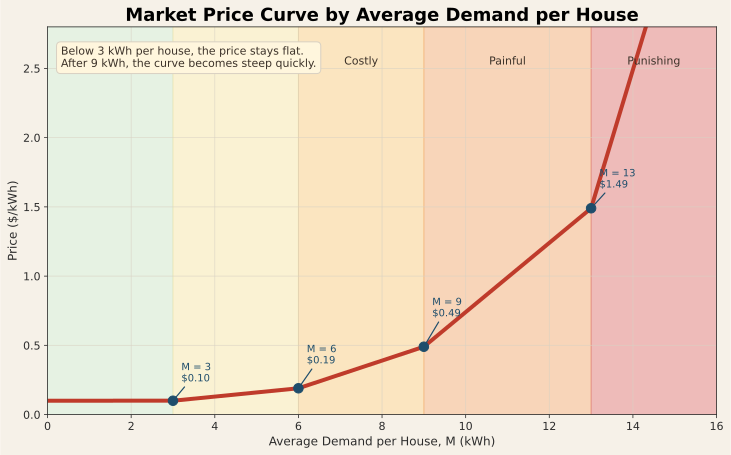
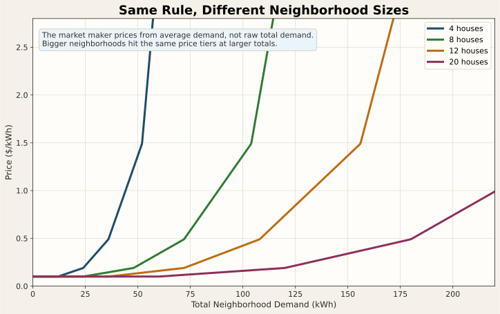
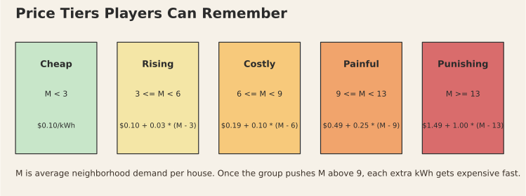

# Market Game

The market game is a small HELICS co-simulation that is meant to be easy to
play with a group. Each player controls one house. Every house has a 24-hour
load profile and a battery. The market maker publishes an hourly electricity
price, and each house decides how much power to buy from the market for that
hour.

If you are new to HELICS, the important thing to know is this:

- You do not need to understand the HELICS setup to play.
- Your strategy lives in one Python method: `compute_demand()`.
- The rest of the code is mostly communication and plotting.

## What To Edit

Start from [house_template.py](/c:/CodeProjects/HELICS-Examples/python/market_game/house_template.py).
The usual workflow is:

1. Copy it into `python/market_game/houses/`, for example `my_house.py`.
2. Create a subclass of `House`.
3. Implement `compute_demand(...)`.
4. Instantiate your house with a unique name in `if __name__ == "__main__":`.

You can use [house_test.py](/c:/CodeProjects/HELICS-Examples/python/market_game/houses/house_test.py)
as a simple example.

There is also [full_cycle_house.py](/c:/CodeProjects/HELICS-Examples/python/market_game/houses/full_cycle_house.py),
which ignores price and simply charges the battery to full, then discharges it
to empty, as a useful baseline strategy.

Another example is [flatten_demand_house.py](/c:/CodeProjects/HELICS-Examples/python/market_game/houses/flatten_demand_house.py),
which ignores price and uses the battery to make the house's market demand as
flat as possible across the day.

For a price-aware example, see [price_aware_house.py](/c:/CodeProjects/HELICS-Examples/python/market_game/houses/price_aware_house.py),
which charges when the price is cheap, discharges when it is expensive, and
tries not to waste stored energy at the end of the day.

If you want `run_neighborhood.py` to find your file without extra flags, give it
a name ending in `_house.py`.

Minimal example:

```python
from house_template import House

class MyHouse(House):
    def compute_demand(self, price, hour, battery_charge, demand, price_history):
        return demand[hour]

if __name__ == "__main__":
    house = MyHouse("MyHouse")
    house.run()
    house.plot_results()
```

## What Your Strategy Sees

Your `compute_demand(self, price, hour, battery_charge, demand, price_history)`
method receives:

- `price`: the current price in $/kWh
- `hour`: the current hour, from `0` to `23`
- `battery_charge`: how much energy is currently stored in the battery
- `demand`: the full 24-hour base demand profile for your house
- `price_history`: the prices seen so far, including the current hour

Your method must return the amount of power the house will buy from the market
for the current hour.

## How The Return Value Works

Let `base = demand[hour]`.

- Return `base` if you do not want to use the battery this hour.
- Return more than `base` if you want to charge the battery.
- Return less than `base` if you want to discharge the battery.

Examples:

- If `base` is `6` and you return `9`, the house buys `9` kWh and stores `3`
  kWh in the battery.
- If `base` is `6` and you return `2`, the battery supplies `4` kWh and the
  market only sees `2` kWh of demand.

## Battery Rules

Each house has the same battery:

- Capacity: `20` kWh
- Starting charge: `0` kWh
- Max charge rate: `5` kWh per hour
- Max discharge rate: `10` kWh per hour

The template checks these limits for you. If your strategy returns an invalid
value, it is clamped back into the legal range and a warning is printed.

## Market Rules

The market maker sets the next hour's price from the total neighborhood demand.
If there are `N` houses, it computes:

- `M = total_demand / N`

Then the price is:

- `M < 3.0`: `$0.10/kWh`
- `3.0 <= M < 6.0`: `0.10 + 0.03 * (M - 3.0)`
- `6.0 <= M < 9.0`: `0.19 + 0.10 * (M - 6.0)`
- `9.0 <= M < 13.0`: `0.49 + 0.25 * (M - 9.0)`
- `M >= 13.0`: `1.49 + 1.00 * (M - 13.0)`

The price lags by one hour: demand in the current hour affects the published
price for the next hour.

This is the main curve players should keep in mind:



The same rule can also be viewed in terms of total neighborhood demand. Bigger
groups hit the same price tiers at larger total loads because the market maker
uses average demand per house:



## Winning The Game

The game runs for 24 hourly steps. The winner is the house with the lowest
total cost over the day while staying within the battery rules.

In plain language, good strategies usually try to:

- charge when the price is low
- discharge when the price is high
- avoid getting stuck with an empty battery during expensive hours

This summary graphic is useful when you want a quick mental model of the tiers:



## Running A Local Round

From [python/market_game](/c:/CodeProjects/HELICS-Examples/python/market_game):

1. Put one or more player files in `houses/` with names matching `*_house.py`.
2. Generate the runner file:

```powershell
python run_neighborhood.py houses
```

3. Start the federation:

```powershell
helics run --path=houses.json
```

This launches the market maker plus every matching house file in `houses/`.

## Files In This Example

- [house_template.py](/c:/CodeProjects/HELICS-Examples/python/market_game/house_template.py):
  base class and player template
- [houses/house_test.py](/c:/CodeProjects/HELICS-Examples/python/market_game/houses/house_test.py):
  example player strategy
- [houses/full_cycle_house.py](/c:/CodeProjects/HELICS-Examples/python/market_game/houses/full_cycle_house.py):
  example strategy that cycles the battery without using price
- [houses/flatten_demand_house.py](/c:/CodeProjects/HELICS-Examples/python/market_game/houses/flatten_demand_house.py):
  example strategy that smooths demand across the day without using price
- [houses/price_aware_house.py](/c:/CodeProjects/HELICS-Examples/python/market_game/houses/price_aware_house.py):
  example strategy that reacts to price using simple thresholds
- [market_maker.py](/c:/CodeProjects/HELICS-Examples/python/market_game/market_maker.py):
  game coordinator and price calculation
- [battery.py](/c:/CodeProjects/HELICS-Examples/python/market_game/battery.py):
  battery limits and validation helpers
- [run_neighborhood.py](/c:/CodeProjects/HELICS-Examples/python/market_game/run_neighborhood.py):
  helper that builds `houses.json` for `helics run`
